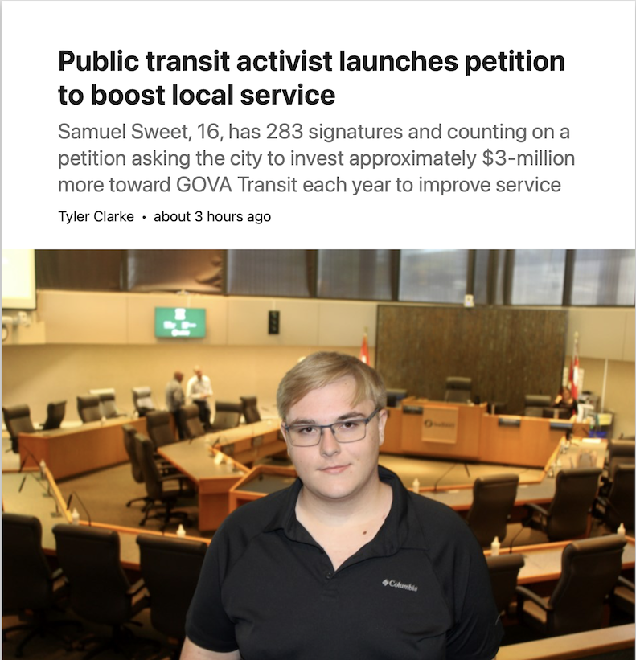

Samuel Sweet, 16, has 283 signatures and counting on a petition asking the city
to invest approximately $3-million more toward GOVA Transit each year to improve
service.

[\>\>\> Click Here to Read the Full Article on Sudbury.com \<\<\<](https://www.sudbury.com/local-news/public-transit-activist-launches-petition-to-boost-local-service-10482271)

