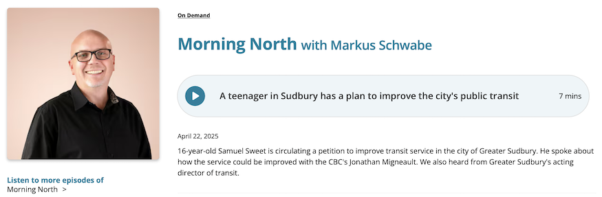

16-year-old Samuel Sweet is circulating a petition to improve transit service in the city of Greater Sudbury. He spoke about how the service could be improved with the CBC's Jonathan Migneault. We also heard from Greater Sudbury's acting director of transit.

[\>\>\> Click Here to Listen to the Interview on cbc.ca \<\<\<](https://www.cbc.ca/listen/live-radio/1-41-morning-north/clip/16141484-a-teenager-sudbury-plan-improve-citys-public-transit)

