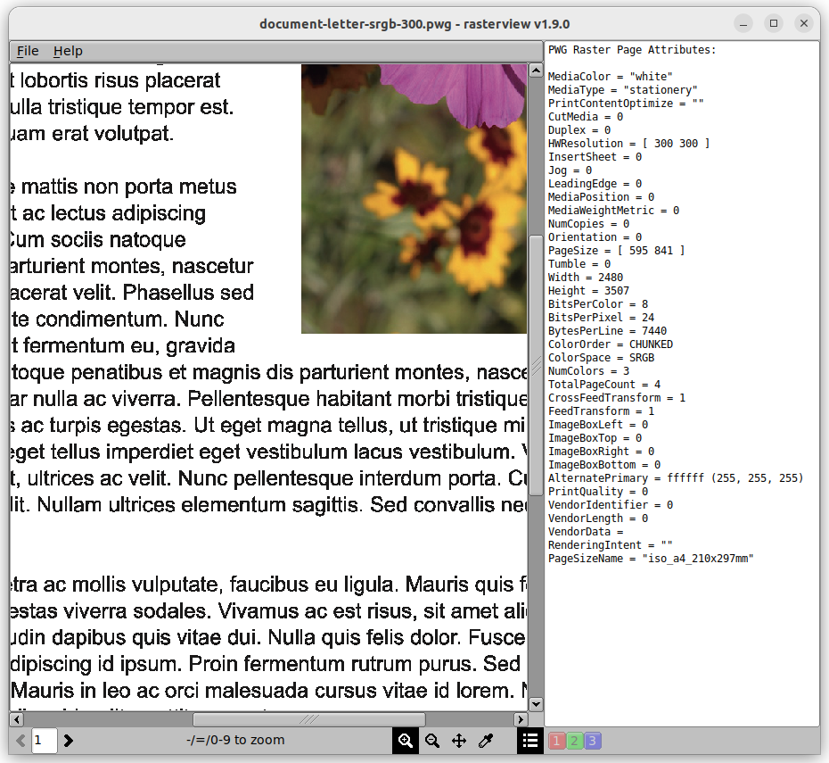

Introduction
============

RasterView is a CUPS, PWG, and Apple raster file viewer.  It basically allows
you to look at the raster data produced by any of the standard CUPS RIP filters
(`cgpdftoraster`, `imagetoraster`, `pdftoraster`, and `pstoraster`) or the
`ipptransform` tool and is normally used to either test those filters or look
at the data that is being sent to your raster printer driver or printer.

RasterView is licensed under the Apache License Version 2.0.

Running RasterView
==================

The program is called "rasterview" on UNIX/Linux and "RasterView.app" on macOS.
Run the program and then open a raster file, or pass the filename on the
command-line.  You can view multiple files simultaneously.

The Basics
----------

RasterView starts in *zoom in* mode (`Z`) which allows you to click on the page
or drag a zoom box on the page to zoom in. You can also use *pan* mode (`P`) to
drag/pan the page in the window, *zoom out* mode (`SHIFT + Z`) to click on the
page to zoom out, or *color viewing* mode (`C`) to click or drag the mouse and
view the raw colors on the page and copy the color values to the clipboard.

Keyboard Shortcuts
------------------

- `Spacebar`: Show next page
- `Backspace/Delete`: Show previous page
- `0`: Zoom to fit
- `1`: Zoom 100%
- `2`: Zoom 200%
- `3`: Zoom 300%
- `4`: Zoom 400%
- `-`: Zoom out
- `=`: Zoom in
- `C`: Click or drag mouse to view colors
- `P`: Drag mouse to pan
- `Z`: Click or drag mouse to zoom in
- `SHIFT + Z`: Click to zoom out
- `CTRL/CMD + A`: Show/hide the page attributes
- `CTRL/CMD + O`: Open a raster file
- `CTRL/CMD + Q`: Quit RasterView
- `CTRL/CMD + R`: Reload the raster file
